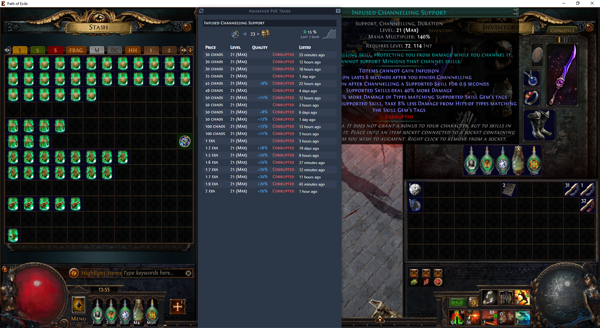
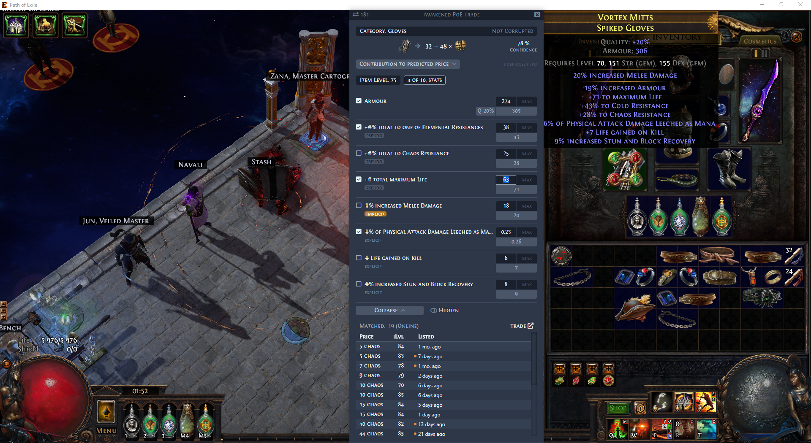
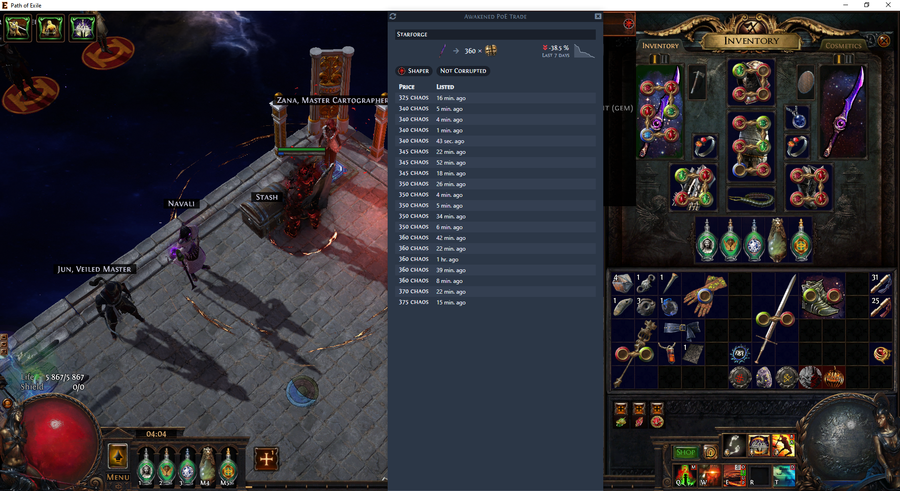

#  Awakened PoE Trade

## Tool showcase

**DISCLAIMER** Not final wanted results are shown, but what you will see using the tool today.

| Gem | Rare | Unique | Currency |
|-----|------|--------|----------|
|  |  |  |  |

| [YouTube] Speed comparison with PoE-TradeMacro |
|-----|
|  |

## What item types it already supports?
At first I want to rephrase this question to "Window shows a bunch of numbers, to what of them I can trust?"
- Rare items
  - [x] Price prediction
  - [ ] Trade results
  - [ ] Rare Maps
- Currency, Fragments, Fossils...
  - [x] poe.ninja instant prices and trends
  - [x] Trade results
- Unique items
  - [-] poe.ninja instant prices and trends
    - [ ] 5, 6 Linked sockets
    - [x] Item
  - [x] 
  - [-] Trade results
    - [x] ordered by min price, without applying +/- 20% mod rolls
    - [x] 5, 6 Linked sockets
    - [ ] Has 2 Abyssal Sockets...
    - [ ] Corrupted implicits
- Gems
  - [x] poe.ninja instant prices and trends
    - [x] Level, Quality, Corrupted
  - [-] Trade results
    - [x] Level
    - [x] Quality
    - [-] Corrupted

### Acknowledgments

- [vue-cli-plugin-electron-builder](https://github.com/nklayman/vue-cli-plugin-electron-builder)
- [iohook](https://github.com/wilix-team/iohook)
- [node-window-manager](https://github.com/sentialx/node-window-manager)
- [robotjs](https://github.com/octalmage/robotjs)
- [poeprices.info](https://www.poeprices.info/)
- [poe.ninja](https://poe.ninja/)
