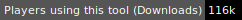
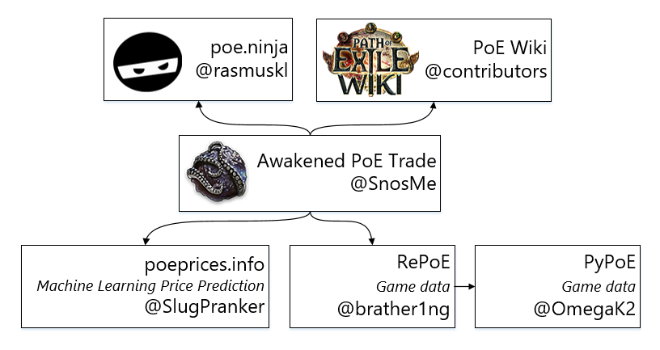

#  Awakened PoE Trade

➡ [Download for Windows & Linux](https://snosme.github.io/awakened-poe-trade/download) ⬅

## Tool showcase

| Gem | Rare | Unique | Currency |
|-----|------|--------|----------|
|  |  |  |  |

### Development

Follow instructions similar to CI [.github/workflows/main.yml](https://github.com/SnosMe/awakened-poe-trade/blob/master/.github/workflows/main.yml)

### Acknowledgments

- [vue-cli-plugin-electron-builder](https://github.com/nklayman/vue-cli-plugin-electron-builder)
- [libuiohook](https://github.com/kwhat/libuiohook)
- [robotjs](https://github.com/octalmage/robotjs)
- [RePoE](https://github.com/brather1ng/RePoE)
- [poeprices.info](https://www.poeprices.info/)
- [poe.ninja](https://poe.ninja/)

